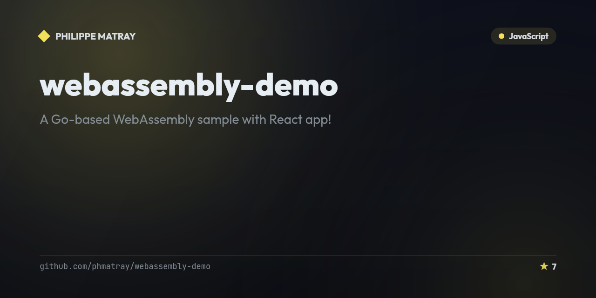

# WebAssembly demo with React and Go 1.12

<!-- portfolio-badges:start -->
<!-- Identity -->
[](https://github.com/phmatray/webassembly-demo)

[](https://github.com/phmatray/webassembly-demo/stargazers)
[](https://github.com/phmatray/webassembly-demo/network/members)
[](https://github.com/phmatray/webassembly-demo/blob/HEAD/LICENSE)

<!-- Activity -->
[](https://github.com/phmatray/webassembly-demo/issues)
[](https://github.com/phmatray/webassembly-demo/pulls)
[](https://github.com/phmatray/webassembly-demo/commits)
<!-- portfolio-badges:end -->


A Go-based WebAssembly sample with React app!


## Installation

### _Client_

```bash
cd client
npm i
npm run dev
```

The client is available on https://localhost:8080

### _Server_

```bash
cd server
npm i
npm run dev
```

The server is available on https://localhost:3000

### _Build the WASM_

```bash
cd server/go
GOOS=js GOARCH=wasm go build -o main.wasm
```

<!-- portfolio-techstack:start -->

## Tech Stack

- **JavaScript**
- react
- react-dom

<!-- portfolio-techstack:end -->

## Contributing

Pull requests are welcome. For major changes, please open an issue first to discuss what you would like to change.

## Some ideas for pull requests

- Use Create-React-App
- Use TypeScript
- Style the exemple
- Add more scenarii using WebAssembly
- Write a script to install all dependencies with a single command

## Resources

- [How to take off with WebAssembly for Go in React](https://medium.freecodecamp.org/taking-off-with-webassembly-for-go-in-react-7c099bd907fa) by Chris Chuck
- [The world’s easiest introduction to WebAssembly🕹](https://medium.freecodecamp.org/webassembly-with-golang-is-fun-b243c0e34f02) by Martin Olsansky
- [Learning Golang through WebAssembly](https://www.aaron-powell.com/posts/2019-02-04-golang-wasm-1-introduction/) by Aaron Powell

## Licence

[MIT](LICENCE)
